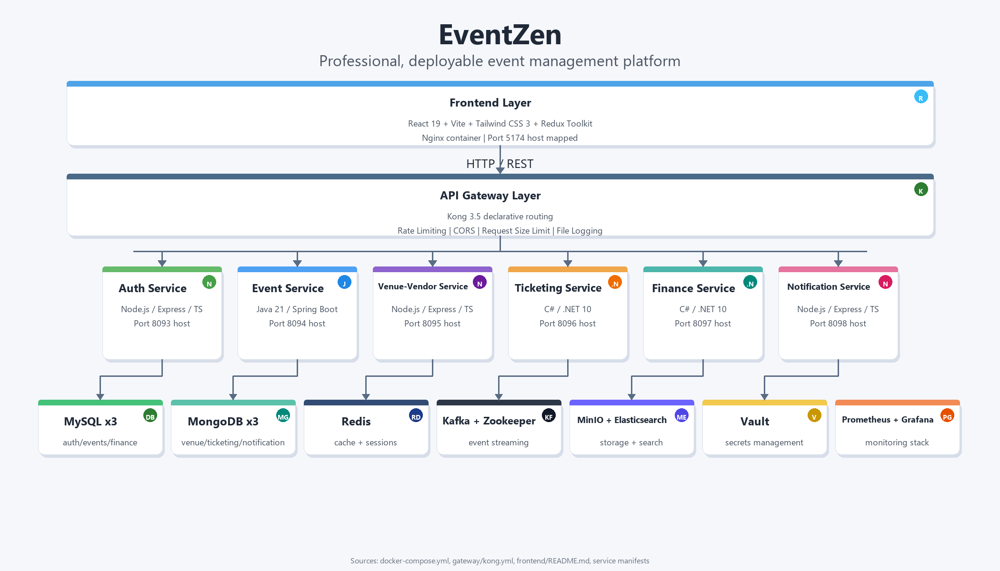

<p align="center">
  
</p>

<h1 align="center">🎪 EventZen</h1>

<p align="center">
  <b>A production-grade, polyglot microservices platform for end-to-end event management</b>
  <br/>
  <i>Built as a Deloitte Capstone Project</i>
</p>

<p align="center">
  
  
  
  
  
  
  
  
  
  
</p>

---

## 📑 Table of Contents

- [🌟 Project Overview](#-project-overview)
- [🏗 Architecture](#-architecture)
- [💻 Tech Stack](#-tech-stack)
- [🧩 Microservices Breakdown](#-microservices-breakdown)
- [✨ Features](#-features)
- [📸 UI Screenshots](#-ui-screenshots)
- [🗄 Database Schema](#-database-schema)
- [🔐 Security Implementation](#-security-implementation)
- [📨 Event-Driven Architecture (Kafka)](#-event-driven-architecture-kafka)
- [📊 Monitoring & Observability](#-monitoring--observability)
- [⚡ Performance Optimizations](#-performance-optimizations)
- [📂 Project Structure](#-project-structure)
- [🚀 Getting Started](#-getting-started)
- [🔑 Environment Variables](#-environment-variables)
- [🐳 Docker Deployment](#-docker-deployment)
- [🧪 Testing](#-testing)
- [🔄 CI/CD Pipeline](#-cicd-pipeline)
- [👥 Contributing](#-contributing)
- [📄 License](#-license)

---

## 🌟 Project Overview

**EventZen** is a full-stack, cloud-ready event management platform that enables:

| Role | Capabilities |
|------|-------------|
| **Admins** | Create, manage, and publish events · Manage venues & vendors · Budget tracking · Financial reports · Review moderation · Subscription management · QR check-in |
| **Vendors / Organizers** | Create & manage events · Venue management · QR check-in scanning · Financial dashboards · Expense tracking · Reports & analytics · Service catalog |
| **Customers** | Browse & discover events · Multi-tier ticket booking · Secure payments · Digital ticket wallet · QR-code tickets · Notifications · Reviews & ratings |

The platform is built with a **polyglot microservices architecture** — combining **Java (Spring Boot)**, **C# (.NET 10)**, and **Node.js (Express/TypeScript)** for backend services — all orchestrated via **Docker Compose**, secured with **HashiCorp Vault**, routed through a **Kong API Gateway**, and interconnected through **Apache Kafka** for asynchronous event-driven communication.

---

## 🏗 Architecture

EventZen follows a microservices architecture with an API Gateway pattern, event-driven messaging, and secrets management via HashiCorp Vault.

<p align="center">
  
  <br/>
  <em>EventZen microservices architecture — Frontend → Kong API Gateway → 6 polyglot services → MySQL / MongoDB / Kafka / Vault</em>
</p>

```
┌──────────────────────────────────────────────────────────────────┐
│                    FRONTEND (React 19)                           │
│        Vite 8 + TailwindCSS 3 + Redux Toolkit + Framer Motion   │
│                    Nginx (Production)                            │
└────────────────────────────┬─────────────────────────────────────┘
                             │ HTTP / REST
                             ▼
┌──────────────────────────────────────────────────────────────────┐
│                    API GATEWAY (Kong 3.5)                        │
│  Declarative Routing │ Rate Limiting │ CORS │ Request Size Limit │
│                 File Logging │ Health Checks                     │
└────┬────────┬────────┬────────┬────────┬────────┬───────────────┘
     │        │        │        │        │        │
     ▼        ▼        ▼        ▼        ▼        ▼
┌────────┐┌────────┐┌────────┐┌────────┐┌────────┐┌───────────────┐
│  Auth  ││ Event  ││ Venue- ││Ticket- ││Finance ││ Notification  │
│Service ││Service ││Vendor  ││  ing   ││Service ││   Service     │
│Node/TS ││Java/SB ││Node/TS ││.NET 10 ││.NET 10 ││   Node/TS     │
│  8081  ││  8082  ││  8083  ││  8084  ││  8085  ││    8086       │
└───┬────┘└───┬────┘└───┬────┘└───┬────┘└───┬────┘└───────┬───────┘
    │         │         │         │         │             │
    ▼         ▼         ▼         ▼         ▼             ▼
┌────────────────────────────────────────────────────────────────┐
│                     DATA & INFRASTRUCTURE                      │
│                                                                │
│  MySQL x3         MongoDB x3        Redis 7       Kafka 7.5   │
│  (auth/events/    (venue/ticketing/  (cache/       (event      │
│   finance)         notification)      sessions)    streaming)  │
│                                                                │
│  MinIO            Elasticsearch     Vault 1.17    Prometheus   │
│  (object          (full-text        (secrets      + Grafana    │
│   storage)         search)           management)  (monitoring) │
└────────────────────────────────────────────────────────────────┘
```

---

## 💻 Tech Stack

### Frontend
| Technology | Version | Purpose |
|-----------|---------|---------|
| React | 19 | UI framework with lazy loading & Suspense |
| Vite | 8 | Build tool & dev server |
| TypeScript | 5.9 | Type safety |
| TailwindCSS | 3.4 | Utility-first styling |
| Redux Toolkit | 2.11 | State management with RTK Query |
| React Router | 6.30 | Client-side routing |
| Framer Motion | 12 | Animations & page transitions |
| Recharts | 3.8 | Data visualization & charts |
| D3.js | 7.9 | Advanced data visualizations |
| Zod | 4.3 | Runtime schema validation |
| React Hook Form | 7.71 | Form management |
| QRCode.react | 4.2 | QR code generation |
| jsPDF + html2canvas | — | PDF ticket export |

### Backend Services
| Service | Language/Framework | Database | Port |
|---------|-------------------|----------|------|
| Auth Service | Node.js / Express 5 / TypeScript | MySQL 8.0 | 8081 |
| Event Service | Java 21 / Spring Boot 3.2 | MySQL 8.0 | 8082 |
| Venue-Vendor Service | Node.js / Express 4 / TypeScript | MongoDB 7 | 8083 |
| Ticketing Service | C# / .NET 10 / ASP.NET Core | MongoDB 7 | 8084 |
| Finance Service | C# / .NET 10 / ASP.NET Core | MySQL 8.0 | 8085 |
| Notification Service | Node.js / Express 5 / TypeScript | MongoDB 7 | 8086 |

### Infrastructure
| Component | Technology | Purpose |
|-----------|-----------|---------|
| API Gateway | Kong 3.5 | Declarative routing, rate limiting, CORS |
| Message Broker | Apache Kafka 7.5 (Confluent) | Event-driven async communication |
| Caching | Redis 7 Alpine | Session store, response caching |
| Object Storage | MinIO | Media uploads (venue/event images) |
| Search | Elasticsearch 8.12 | Full-text event search |
| Secrets | HashiCorp Vault 1.17 | KV v2 secret management |
| Monitoring | Prometheus 2.51 + Grafana 10.4 | Metrics, dashboards, alerting |
| Container Metrics | cAdvisor 0.49 + Node Exporter 1.7 | Infrastructure telemetry |
| Orchestration | Docker Compose | Multi-container orchestration |
| CI/CD | GitHub Actions | Automated build, test, deploy |

---

## 🧩 Microservices Breakdown

### 1. Auth Service (`services/auth-service`)
> **Tech:** Node.js · Express 5 · TypeScript · Knex.js · MySQL

| Feature | Details |
|---------|---------|
| Registration | Email + password with OTP-based email verification (Speakeasy TOTP) |
| Login | JWT access token + refresh token rotation with cookie storage |
| Password Reset | Forgot → OTP verification → Secure reset flow |
| User Management | Profile CRUD, email change with OTP re-verification |
| Role System | `CUSTOMER` / `ORGANIZER` / `VENDOR` / `ADMIN` with role-based guards |
| Vendor Applications | Customer → Vendor role upgrade request & admin approval workflow |
| Security | bcrypt password hashing, Helmet, HPP, rate limiting, PII encryption |
| Observability | Prometheus metrics (`http_requests_total`, `http_request_duration_seconds`), Winston structured logging |
| API Docs | Swagger UI at `/api/v1/auth/docs` |

### 2. Event Service (`services/event-service`)
> **Tech:** Java 21 · Spring Boot 3.2 · Spring Data JPA · MySQL · Flyway

| Feature | Details |
|---------|---------|
| Event CRUD | Full lifecycle management with rich event model |
| Event States | `DRAFT` → `PUBLISHED` → `CANCELLED` (state machine pattern) |
| Categories & Tags | Hierarchical event categorization and tagging |
| Sessions & Agenda | Multi-session events with agenda ordering and session types |
| Search | Paginated, filtered event queries by status, date, category |
| Kafka Publishing | Publishes `event.created`, `event.updated`, `event.status.changed`, `event.deleted` |
| Auth | JWT filter with Spring Security integration |
| Caching | Spring Data Redis for response caching |
| Migrations | Flyway database migrations |
| Observability | Spring Actuator + Micrometer Prometheus at `/actuator/prometheus` |
| API Docs | SpringDoc OpenAPI at `/swagger-ui.html` |

### 3. Venue-Vendor Service (`services/venue-vendor-service`)
> **Tech:** Node.js · Express 4 · TypeScript · Mongoose · MongoDB

| Feature | Details |
|---------|---------|
| Venue Management | CRUD for venues with capacity, location, amenities |
| Vendor Profiles | Service catalog, pricing, availability |
| Contracts | Vendor-event contract lifecycle management |
| Vendor Expenses | Expense tracking per vendor per event |
| Media Upload | MinIO-backed file upload for venue/event images |
| Caching | Redis response caching |
| Kafka | Event publishing for venue bookings |
| Validation | Zod schema validation |
| API Docs | Swagger UI at `/api/v1/venues/docs` |

### 4. Ticketing Service (`services/ticketing-service`)
> **Tech:** C# · .NET 10 · ASP.NET Core · MongoDB Driver

| Feature | Details |
|---------|---------|
| Ticket Types | Multi-tier ticket configurations (VIP, General, Early Bird, etc.) |
| Registration | Event registration with ticket type selection and quantity |
| Ticket Issuance | HMAC-secured unique ticket generation |
| QR Codes | QR code generation for each ticket (using custom QrCodeService) |
| Check-in | QR-based check-in system with scan verification |
| Waitlist | Automatic waitlist management with promotion notifications |
| Feedback | Post-event review and rating system |
| Idempotency | Idempotency middleware for safe retries (`Idempotency-Key` header) |
| Caching | StackExchange.Redis for response caching |
| Kafka | Publishes `registration.confirmed`, `ticket.purchased`, `registration.cancelled`, `waitlist.promoted` |
| Observability | prometheus-net metrics at `/metrics` |
| API Docs | Swagger UI at `/api/v1/tickets/docs` |

### 5. Finance Service (`services/finance-service`)
> **Tech:** C# · .NET 10 · ASP.NET Core · Entity Framework Core · MySQL

| Feature | Details |
|---------|---------|
| Budgets | Per-event budget creation with line items (approved amounts) |
| Expenses | Expense tracking with category, vendor, and approval status |
| Payments | Simulated payment gateway (EventZen Pay) with order creation & verification |
| Sponsorships | Event sponsorship management (company, logo, amount) |
| Revenue | Admin revenue dashboard with per-event and aggregate analytics |
| Reports | Financial reporting with budget vs. actual analysis |
| Auto-Expenses | Kafka consumer auto-creates venue expenses when venues are booked |
| Migrations | EF Core auto-migrate with fallback to `EnsureCreated` |
| Observability | prometheus-net metrics at `/metrics` |
| API Docs | Swagger UI at `/api/v1/payments/docs` |

### 6. Notification Service (`services/notification-service`)
> **Tech:** Node.js · Express 5 · TypeScript · KafkaJS · MongoDB · Socket.IO

| Feature | Details |
|---------|---------|
| Kafka Consumer | Subscribes to 20+ Kafka topics across all services |
| Channel Routing | Routes notifications to `EMAIL`, `SMS`, `PUSH`, `IN_APP` channels |
| Template Engine | Handlebars-based notification templates with dynamic payload |
| Topic Handlers | Declarative topic → notification mapping with user resolution |
| WebSocket | Real-time in-app notifications via Socket.IO |
| Notification API | List, mark-read, mark-all-read, delete user notifications |
| Multi-Provider | Pluggable providers: Nodemailer (email), Twilio (SMS), FCM (push) |
| Observability | Prometheus metrics for notification processing throughput |
| API Docs | Swagger UI at `/api/v1/notifications/docs` |

---

## ✨ Features

### 🔐 Authentication & Authorization
- **OTP-Verified Registration** — 6-digit TOTP via email with expiry & resend
- **JWT Authentication** — Access token + refresh token rotation with HTTP-only cookies
- **Role-Based Access Control** — Customer, Organizer, Vendor, Admin roles with protected routes
- **Password Reset** — Forgot password → OTP → Secure reset flow
- **Vendor Onboarding** — Customer → Vendor role upgrade request & admin approval

### 🎫 Event & Ticketing
- **Full Event Lifecycle** — Draft → Published → Cancelled with state machine enforcement
- **Multi-Session Events** — Agenda management with session scheduling
- **Multi-Tier Tickets** — VIP, General, Early Bird with per-type pricing & capacity
- **Digital Ticket Wallet** — QR code tickets with PDF export & group passes
- **QR Check-In** — Real-time QR scanning for event entry verification
- **Waitlist System** — Automatic promotion when capacity frees up

### 💰 Finance & Payments
- **Budget Management** — Per-event budgets with line item tracking
- **Expense Tracking** — Categorized expenses with vendor association
- **Integrated Payments** — Simulated gateway with order creation & Kafka notifications
- **Sponsorship Portal** — Sponsor management with logo and contribution tracking
- **Revenue Analytics** — Admin dashboard with per-event revenue and platform metrics
- **Financial Reports** — Budget vs. actual analysis with exportable data

### 🏢 Venue & Vendor Management
- **Venue CRUD** — Capacity, location, amenities, media uploads
- **Vendor Catalog** — Services, pricing, availability management
- **Contract Lifecycle** — Vendor-event contract creation and tracking
- **Media Storage** — MinIO-backed image upload for venues and events

### 🔔 Real-Time Notifications
- **20+ Kafka Topics** — Comprehensive event coverage across all services
- **Multi-Channel** — In-App, Email, SMS, Push notification delivery
- **Real-Time WebSocket** — Instant in-app notification via Socket.IO
- **Smart Routing** — Topic-based channel routing with user resolution

### 📊 Analytics & Reporting
- **Admin Dashboard** — Platform-wide event, financial, and user analytics
- **Vendor Dashboard** — Per-vendor event performance and financial metrics
- **Recharts & D3** — Interactive data visualizations
- **PDF Reports** — Exportable financial and attendance reports

---

## 📸 UI Screenshots

The project includes 29 UI screenshots in the `Screenshots of UI/` directory covering:

| Portal | Screens |
|--------|---------|
| **Landing & Public** | Landing page, event listing, event detail, pricing page |
| **Authentication** | Login/Register, OTP verification, password reset |
| **Customer Portal** | Dashboard, ticket wallet, digital passes, checkout |
| **Vendor Portal** | Dashboard, event management, venue management, finance, check-in, reviews |
| **Admin Portal** | Dashboard, event management, venues, vendors, finance, reports, applications, subscriptions |
| **Shared** | Notifications, settings, registration management |

<details>
<summary><b>📷 Click to see sample screenshots</b></summary>

> Screenshots are located in [`Screenshots of UI/`](Screenshots%20of%20UI/) directory. Here are the key screens:

| Screen | File |
|--------|------|
| Landing Page | `Screenshot 2026-03-30 181554.png` |
| Event Listing | `Screenshot 2026-03-30 181611.png` |
| Event Detail | `Screenshot 2026-03-30 181630.png` |
| Admin Dashboard | `Screenshot 2026-03-30 182027.png` |
| Vendor Finance | `Screenshot 2026-03-30 182818.png` |
| Ticket Wallet | `Screenshot 2026-03-30 183024.png` |
| Check-In Scanner | `Screenshot 2026-03-30 183124.png` |

</details>

---

## 🗄 Database Schema

EventZen uses a **polyglot persistence** strategy with per-service database isolation:

### MySQL Databases (Relational Data)
```
┌─────────────────────────────┐
│  eventzen_auth (MySQL)      │
│  ├── users                  │
│  ├── roles                  │
│  ├── user_roles             │
│  ├── otps                   │
│  └── account_requests       │
├─────────────────────────────┤
│  eventzen_events (MySQL)    │
│  ├── events                 │
│  ├── event_categories       │
│  ├── event_tags             │
│  ├── event_sessions         │
│  └── event_agendas          │
├─────────────────────────────┤
│  eventzen_finance (MySQL)   │
│  ├── budgets                │
│  ├── budget_items           │
│  ├── expenses               │
│  ├── payments               │
│  ├── sponsorships           │
│  └── financial_reports      │
└─────────────────────────────┘
```

### MongoDB Databases (Document Data)
```
┌─────────────────────────────┐
│  eventzen_venue (MongoDB)   │
│  ├── venues                 │
│  ├── vendors                │
│  ├── contracts              │
│  └── vendor_expenses        │
├─────────────────────────────┤
│  eventzen_ticketing (Mongo) │
│  ├── ticket_types           │
│  ├── registrations          │
│  ├── tickets                │
│  ├── checkin_logs           │
│  ├── waitlists              │
│  └── feedbacks              │
├─────────────────────────────┤
│  eventzen_notifications     │
│  └── notifications          │
└─────────────────────────────┘
```

### Schema Migration Strategy
| Service | Strategy | Tool |
|---------|----------|------|
| Auth Service | Code-first migrations | Knex.js |
| Event Service | Code-first migrations | Flyway |
| Finance Service | Auto-migrate / EnsureCreated | EF Core |
| Venue-Vendor Service | Schema-less (Mongoose models) | Mongoose |
| Ticketing Service | Auto-index creation | MongoDB.Driver |
| Notification Service | Schema-less (Mongoose models) | Mongoose |

---

## 🔐 Security Implementation

### Defense in Depth

```
┌─────────────────────────────────────────────────────┐
│                    Kong Gateway                      │
│  Rate Limiting (100 req/min) │ Request Size (10MB)   │
│  CORS Whitelist │ File Logging                       │
├─────────────────────────────────────────────────────┤
│                Service-Level Security                │
│  Helmet (HTTP headers) │ HPP (param pollution)       │
│  Express Rate Limiting │ Zod Input Validation        │
│  FluentValidation (.NET) │ Spring Validation (Java) │
├─────────────────────────────────────────────────────┤
│              Authentication & Authorization           │
│  JWT Access + Refresh Tokens │ bcrypt Hashing         │
│  Role-Based Guards │ TOTP OTP Verification            │
│  PII Encryption (AES) │ HMAC Ticket Signing           │
├─────────────────────────────────────────────────────┤
│              Secrets Management                       │
│  HashiCorp Vault (KV v2) │ AppRole Auth               │
│  Dev Mode: Auto-seeded │ Prod: Vault Agent Sidecars   │
│  PowerShell Render Pipeline (Render-VaultEnv.ps1)     │
└─────────────────────────────────────────────────────┘
```

### Security Features by Layer

| Layer | Implementation |
|-------|---------------|
| **Transport** | CORS whitelist, Helmet security headers, request size limits |
| **Authentication** | JWT (access + refresh) with rotation, HTTP-only cookie storage |
| **Password** | bcrypt with salt rounds, TOTP-based OTP for email verification |
| **Input Validation** | Zod (Node.js), FluentValidation (.NET), Spring Validation (Java) |
| **Rate Limiting** | Kong global (100 req/min) + service-level rate limiting |
| **Secrets** | HashiCorp Vault KV v2 with auto-seeding in dev mode |
| **PII Protection** | AES encryption for personally identifiable information |
| **Ticket Security** | HMAC-SHA256 signed tickets to prevent forgery |
| **Idempotency** | `Idempotency-Key` header support in ticketing service |

### Vault Integration

```bash
# Dev mode: Vault auto-seeds secrets from .env
docker compose --profile vault-dev up -d vault vault-init

# Secrets are stored at: secret/eventzen/shared
# Render-VaultEnv.ps1 generates local.env from Vault
```

All service secrets (DB passwords, JWT keys, API keys, SMTP credentials) are managed through Vault's KV v2 secret engine with environment-specific rendering.

---

## 📨 Event-Driven Architecture (Kafka)

### Kafka Topics (20+ Events)

```
┌─────────────────────────────────────────────────────────────────┐
│                        KAFKA TOPICS                              │
├─────────────────┬───────────────────┬───────────────────────────┤
│  Auth Events    │  Event Events     │  Ticketing Events          │
│  ─────────────  │  ──────────────   │  ────────────────          │
│  user.registered│  event.created    │  ticket.purchased          │
│  user.password  │  event.updated    │  registration.confirmed    │
│    .reset       │  event.cancelled  │  registration.cancelled    │
│                 │  event.published  │  waitlist.promoted         │
│                 │  event.status     │                            │
│                 │    .changed       │                            │
│                 │  event.deleted    │                            │
│                 │  event.reminder   │                            │
│                 │    .24h / .1h     │                            │
├─────────────────┼───────────────────┼───────────────────────────┤
│  Finance Events │  Venue Events     │  Notification Channels     │
│  ─────────────  │  ────────────     │  ─────────────────         │
│  payment        │  venue.booked     │  notification.email        │
│    .received    │  vendor.contract  │  notification.sms          │
│  payment.failed │    .signed        │  notification.push         │
│  budget.alert   │  checkin          │                            │
│    .threshold   │    .milestone     │                            │
└─────────────────┴───────────────────┴───────────────────────────┘
```

### Producer → Consumer Flow

```
Auth Service ──────→ user.registered ──────→ Notification Service
                     user.password.reset       │
                                               │  Creates notification
Event Service ─────→ event.created ───────→    │  records in MongoDB
                     event.updated              │
                     event.status.changed       │  Routes to channels:
                     event.deleted              │  • IN_APP (WebSocket)
                                               │  • EMAIL (Nodemailer)
Ticketing Service ─→ registration.confirmed    │  • SMS (Twilio)
                     ticket.purchased           │  • PUSH (FCM)
                     registration.cancelled     │
                     waitlist.promoted          │

Finance Service ───→ payment.received ─────→   │
                     payment.failed             │
                     budget.alert.threshold     ▼

Venue Service ─────→ venue.booked ──────────→ Finance Service
                                               (auto-creates expense)
```

All topics are created with **3 partitions** and **replication factor 1** via the `kafka/create-topics.sh` init script.

---

## 📊 Monitoring & Observability

### Metrics Collection

Every service exposes Prometheus-compatible metrics:

| Service | Metrics Path | Library |
|---------|-------------|---------|
| Auth Service | `/metrics` | prom-client |
| Event Service | `/actuator/prometheus` | Micrometer |
| Venue-Vendor | `/metrics` | prom-client |
| Ticketing | `/metrics` | prometheus-net |
| Finance | `/metrics` | prometheus-net |
| Notification | `/metrics` | prom-client |

### Monitoring Stack

| Component | Port | Purpose |
|-----------|------|---------|
| Prometheus | `9090` | Metrics collection & alerting (15s scrape, 15d retention) |
| Grafana | `3001` | Dashboards & visualization (auto-provisioned) |
| Node Exporter | `9100` | Host-level system metrics |
| cAdvisor | `8087` | Docker container metrics |

### Pre-Built Dashboard

Grafana ships with a pre-configured **EventZen Overview** dashboard (`monitoring/grafana/dashboards/eventzen-overview.json`) providing:
- Service health & uptime
- Request rate & latency (p50, p95, p99)
- Error rate tracking
- Container resource utilization
- Kafka consumer lag

### Logging

| Service | Library | Output |
|---------|---------|--------|
| Node.js services | Winston | Structured JSON logs |
| Java services | SLF4J / Logback | Structured logs |
| .NET services | Console + middleware | Structured exception handling |

---

## ⚡ Performance Optimizations

| Optimization | Implementation |
|-------------|---------------|
| **Redis Caching** | Response caching across all services (venue lists, event data, session data) |
| **Lazy Loading** | React `lazy()` + `Suspense` for all 30+ pages — zero unnecessary JS bundles |
| **Code Splitting** | Vite automatic code splitting per route |
| **Connection Pooling** | Knex.js (MySQL), Mongoose (MongoDB), StackExchange.Redis pooling |
| **MongoDB Indexing** | Auto-configured indexes on startup (ticketing-service) |
| **Database per Service** | Isolated databases prevent cross-service query bottlenecks |
| **Kafka Partitioning** | 3 partitions per topic for parallel consumption |
| **MinIO Object Storage** | Dedicated media storage offloads binary data from application DBs |
| **Proxy Configuration** | Vite dev server proxy eliminates CORS overhead in development |
| **Docker Health Checks** | All infrastructure services have health checks for dependency ordering |

---

## 📂 Project Structure

```
Deloitte_Capstone/
├── .github/
│   └── workflows/
│       └── ci.yml                    # GitHub Actions CI pipeline
├── Screenshots of UI/               # 29 UI screenshots
├── Deloitte_Capstone.sln            # Visual Studio solution file
├── START.bat                        # One-click local startup script
│
└── eventzen/                        # Main application root
    ├── .env                         # Environment variables (gitignored)
    ├── .env.example                 # Environment template
    ├── docker-compose.yml           # 20+ container orchestration
    ├── start-all.bat                # Alternative startup script
    │
    ├── frontend/                    # React 19 SPA
    │   ├── src/
    │   │   ├── App.tsx              # Route definitions (30+ routes)
    │   │   ├── components/          # 13 component categories
    │   │   │   ├── auth/            # Login, Register, OTP forms
    │   │   │   ├── dashboard/       # Dashboard widgets
    │   │   │   ├── events/          # Event cards, detail, creation
    │   │   │   ├── finance/         # Budget, expense, payment views
    │   │   │   ├── landing/         # Landing page sections
    │   │   │   ├── layout/          # PublicLayout, PortalLayout
    │   │   │   ├── reviews/         # Review & rating components
    │   │   │   ├── shared/          # Reusable UI elements
    │   │   │   ├── tickets/         # Ticket wallet, passes, QR
    │   │   │   ├── ui/              # Design system primitives
    │   │   │   ├── users/           # User management
    │   │   │   ├── vendors/         # Vendor components
    │   │   │   └── venues/          # Venue components
    │   │   ├── pages/               # Route-level page components
    │   │   │   ├── admin/           # 10 admin pages
    │   │   │   ├── customer/        # 2 customer pages
    │   │   │   ├── public/          # 8 public pages
    │   │   │   ├── shared/          # 12 shared authenticated pages
    │   │   │   └── vendor/          # 8 vendor pages
    │   │   ├── store/               # Redux store
    │   │   │   ├── api/             # 7 RTK Query API slices
    │   │   │   └── slices/          # Auth state slice
    │   │   ├── context/             # AuthContext provider
    │   │   ├── guards/              # AuthGuard, RoleGuard
    │   │   ├── hooks/               # useAuth, useBreakpoint, useScrollReveal
    │   │   ├── config/              # API base URLs
    │   │   ├── styles/              # Global CSS
    │   │   └── utils/               # Utility functions
    │   ├── Dockerfile               # Frontend container
    │   ├── vite.config.ts           # Vite + proxy config
    │   └── tailwind.config.js       # TailwindCSS theme
    │
    ├── services/
    │   ├── auth-service/            # Node.js / TypeScript
    │   │   ├── src/
    │   │   │   ├── server.ts        # Express app bootstrap
    │   │   │   ├── controllers/     # auth, user, accountRequest
    │   │   │   ├── routes/          # Route definitions
    │   │   │   ├── services/        # Business logic
    │   │   │   ├── middleware/      # Auth, rate limiting, errors
    │   │   │   ├── database/        # Knex migrations & seeds
    │   │   │   ├── events/          # Kafka producer
    │   │   │   ├── cache/           # Redis caching layer
    │   │   │   ├── validators/      # Zod schemas
    │   │   │   ├── docs/            # OpenAPI spec
    │   │   │   └── utils/           # Logger, crypto helpers
    │   │   ├── knexfile.ts          # Database config
    │   │   └── Dockerfile
    │   │
    │   ├── event-service/           # Java / Spring Boot
    │   │   ├── src/main/java/com/eventzen/event/
    │   │   │   ├── EventServiceApplication.java
    │   │   │   ├── config/          # Kafka, Elasticsearch, OpenAPI
    │   │   │   ├── model/           # Entities, DTOs, Enums
    │   │   │   ├── repository/      # JPA repositories
    │   │   │   ├── service/         # Event, Category, Session, Agenda
    │   │   │   ├── security/        # JWT filter & provider
    │   │   │   └── util/            # State machine, converters
    │   │   ├── pom.xml              # Maven dependencies
    │   │   └── Dockerfile
    │   │
    │   ├── venue-vendor-service/    # Node.js / TypeScript
    │   │   ├── src/
    │   │   │   ├── server.ts
    │   │   │   ├── controllers/     # Venue, vendor, contract, upload
    │   │   │   ├── routes/          # Venue, vendor, contract, upload
    │   │   │   ├── models/          # Mongoose schemas
    │   │   │   ├── services/        # Business logic
    │   │   │   ├── middleware/      # Auth, validation
    │   │   │   ├── events/          # Kafka integration
    │   │   │   ├── cache/           # Redis layer
    │   │   │   └── validators/      # Zod schemas
    │   │   └── Dockerfile
    │   │
    │   ├── ticketing-service/       # C# / .NET 10
    │   │   ├── Program.cs           # App bootstrap
    │   │   ├── Controllers/         # TicketType, Registration, Ticket, Checkin, Feedback
    │   │   ├── Services/            # Registration, Ticket, Checkin, QR, Waitlist, Feedback
    │   │   ├── Models/              # TicketType, Registration, Ticket, Checkin, Waitlist, Feedback
    │   │   ├── DTOs/                # Request/Response DTOs
    │   │   ├── Infrastructure/      # MongoDB, Redis, Kafka, JWT Auth
    │   │   ├── Middleware/          # Exception, Idempotency
    │   │   ├── Helpers/             # Utility classes
    │   │   └── Dockerfile
    │   │
    │   ├── finance-service/         # C# / .NET 10
    │   │   ├── Program.cs           # App bootstrap
    │   │   ├── Controllers/         # Budget, Expense, Payment, Report, Sponsorship, AdminRevenue
    │   │   ├── Services/            # Budget, Payment, Expense, Report, Sponsorship, AdminRevenue
    │   │   ├── Models/              # Budget, BudgetItem, Expense, Payment, Sponsorship, Report
    │   │   ├── DTOs/                # Request/Response DTOs
    │   │   ├── Infrastructure/      # EF DbContext, Kafka, JWT Auth
    │   │   ├── Middleware/          # Exception handling
    │   │   └── Dockerfile
    │   │
    │   └── notification-service/    # Node.js / TypeScript
    │       ├── src/
    │       │   ├── server.ts
    │       │   ├── kafka/           # Consumer + 20+ topic handlers
    │       │   ├── websocket/       # Socket.IO real-time delivery
    │       │   ├── providers/       # Email, SMS, Push providers
    │       │   ├── models/          # Notification Mongoose model
    │       │   ├── controllers/     # Notification CRUD
    │       │   ├── routes/          # Notification routes
    │       │   └── services/        # Notification logic
    │       └── Dockerfile
    │
    ├── gateway/
    │   └── kong.yml                 # Kong declarative config
    │
    ├── kafka/
    │   └── create-topics.sh         # Auto-create 20+ topics
    │
    ├── db/
    │   ├── mysql/                   # MySQL init scripts (x3)
    │   └── mongo/                   # MongoDB init scripts (x3)
    │
    ├── monitoring/
    │   ├── prometheus.yml           # Scrape configs for all services
    │   └── grafana/
    │       ├── dashboards/          # Pre-built EventZen dashboard
    │       └── provisioning/        # Auto-provisioning config
    │
    ├── scripts/
    │   ├── vault/
    │   │   ├── seed-dev.sh          # Vault dev secret seeding
    │   │   └── Render-VaultEnv.ps1  # Vault → .env renderer
    │   ├── diagrams/                # Architecture diagram scripts
    │   ├── bootstrap-with-vault.ps1 # Bootstrap with Vault
    │   └── Resolve-UnreservedPorts.ps1  # Port conflict resolver
    │
    ├── .vault/
    │   └── generated/               # Vault-rendered env files
    │
    └── docs/
        ├── ci.md                    # CI pipeline documentation
        ├── architecture/            # Architecture diagrams
        └── vault/                   # Vault documentation
```

---

## 🚀 Getting Started

### Prerequisites

| Tool | Version | Required For |
|------|---------|-------------|
| **Node.js** | ≥ 20 | Auth, Venue-Vendor, Notification services + Frontend |
| **Java JDK** | 21 | Event Service (Spring Boot) |
| **.NET SDK** | 10.0 | Ticketing & Finance services |
| **Maven** | 3.9+ | Event Service build |
| **Docker Desktop** | Latest | Infrastructure containers |
| **MongoDB** | 7.x | Local development (or use Docker) |
| **Git** | Latest | Version control |

### Option 1: One-Click Local Start (Windows)

```bash
# Clone the repository
git clone https://github.com/SwapnamoyGhosh03/EventZen.git
cd EventZen

# Copy environment template
cp eventzen/.env.example eventzen/.env
# Edit eventzen/.env with your credentials

# Start everything (infrastructure + all services)
START.bat
```

This launches:
| Component | Port |
|-----------|------|
| MongoDB | 27017 |
| Kafka | 9092 |
| Auth Service | 8081 |
| Event Service | 8082 |
| Venue-Vendor Service | 8083 |
| Ticketing Service | 8084 |
| Finance Service | 8085 |
| Notification Service | 8086 |

### Option 2: Manual Service Start

```bash
# 1. Start infrastructure
mongod --dbpath /path/to/data
# Start Kafka (KRaft mode)

# 2. Start each service
cd eventzen/services/auth-service && npm install && npm run dev
cd eventzen/services/event-service && mvn spring-boot:run
cd eventzen/services/venue-vendor-service && npm install && npm run dev
cd eventzen/services/ticketing-service && dotnet run
cd eventzen/services/finance-service && dotnet run
cd eventzen/services/notification-service && npm install && npm run dev

# 3. Start frontend
cd eventzen/frontend && npm install && npm run dev
```

### Option 3: Docker Compose (Full Stack)

```bash
cd eventzen

# Copy env template
cp .env.example .env

# Start entire stack (20+ containers)
docker compose up -d --build

# With Vault dev mode
docker compose --profile vault-dev up -d --build
```

---

## 🔑 Environment Variables

Copy `.env.example` to `.env` and configure:

```bash
# ─── MySQL ───
MYSQL_ROOT_PASSWORD=your_root_password
AUTH_DB_PASSWORD=auth_db_password
EVENT_DB_PASSWORD=event_db_password
FINANCE_DB_PASSWORD=finance_db_password

# ─── Redis ───
REDIS_PASSWORD=your_redis_password

# ─── JWT ───
JWT_SECRET=your-super-secret-jwt-key
JWT_REFRESH_SECRET=your-refresh-token-key
TICKET_HMAC_SECRET=your-ticket-hmac-key

# ─── PII Encryption ───
PII_ENCRYPTION_KEY=32-char-hex-key

# ─── Stripe (or simulated payments) ───
STRIPE_SECRET_KEY=sk_test_...
STRIPE_WEBHOOK_SECRET=whsec_...

# ─── Email (SMTP) ───
SMTP_HOST=smtp.gmail.com
SMTP_PORT=587
SMTP_USER=your-email@gmail.com
SMTP_PASS=your-app-password
SMTP_FROM=EventZen <noreply@eventzen.com>

# ─── Vault (optional) ───
VAULT_MODE=dev
VAULT_ADDR=http://127.0.0.1:8200
VAULT_TOKEN=eventzen-dev-root
```

For the complete list, see [`.env.example`](eventzen/.env.example).

---

## 🐳 Docker Deployment

### Full Stack (20+ Containers)

```bash
cd eventzen
docker compose up -d --build
```

### Service Ports (Docker)

| Service | Internal Port | Host Port |
|---------|--------------|-----------|
| Frontend | 5173 | 5173 |
| Kong Gateway | 8000 | 8080 |
| Auth Service | 8081 | 8081 |
| Event Service | 8082 | 8082 |
| Venue-Vendor | 8083 | 8083 |
| Ticketing | 8084 | 8084 |
| Finance | 8085 | 8085 |
| Notification | 8086 | 8086 |
| MySQL (Auth) | 3306 | 3306 |
| MySQL (Events) | 3306 | 3307 |
| MySQL (Finance) | 3306 | 3308 |
| MongoDB (Venue) | 27017 | 27017 |
| MongoDB (Ticketing) | 27017 | 27018 |
| MongoDB (Notification) | 27017 | 27019 |
| Redis | 6379 | 6379 |
| Kafka | 9092 | 9092 |
| Zookeeper | 2181 | 2181 |
| MinIO API | 9000 | 9000 |
| MinIO Console | 9001 | 9001 |
| Elasticsearch | 9200 | 9200 |
| Vault | 8200 | 8200 |
| Prometheus | 9090 | 9090 |
| Grafana | 3000 | 3001 |
| cAdvisor | 8080 | 8087 |
| Node Exporter | 9100 | 9100 |

### Docker Volumes

```yaml
mysql_auth_data          # Auth database persistence
mysql_events_data        # Events database persistence
mysql_finance_data       # Finance database persistence
mongo_venue_data         # Venue data persistence
mongo_ticketing_data     # Ticketing data persistence
mongo_notification_data  # Notification data persistence
es_data                  # Elasticsearch indices
minio_data               # Object storage
vault_data               # Vault secrets
prometheus_data          # Metrics history (15d retention)
grafana_data             # Dashboard configurations
```

---

## 🧪 Testing

### Unit Tests

```bash
# Auth Service (Jest)
cd eventzen/services/auth-service
npm test

# Event Service (JUnit + Spring Boot Test)
cd eventzen/services/event-service
mvn -B clean test

# Ticketing Service (.NET)
cd eventzen/services/ticketing-service
dotnet test   # when test project exists

# Finance Service (.NET)
cd eventzen/services/finance-service
dotnet test   # when test project exists
```

### Build Verification

```bash
# Frontend
cd eventzen/frontend
npm run lint
npm run build

# All Node.js services
cd eventzen/services/<service-name>
npm run build

# .NET services
dotnet build --configuration Release
```

### Integration Smoke Tests

```bash
# Start the full stack
cd eventzen
docker compose up -d --build

# Verify all endpoints
curl http://localhost:8081/api/v1/health     # Auth
curl http://localhost:8082/actuator/health   # Event
curl http://localhost:8083/health            # Venue-Vendor
curl http://localhost:8084/api/v1/health     # Ticketing
curl http://localhost:8085/metrics           # Finance
curl http://localhost:8086/health            # Notification
```

---

## 🔄 CI/CD Pipeline

GitHub Actions workflow at `.github/workflows/ci.yml`:

```
┌───────────────────────────────────────────────────────────────┐
│                      CI Pipeline Stages                       │
├───────────────┬───────────────────────────────────────────────┤
│  Stage 1      │  Parallel per-service builds                  │
│  (Build)      │  ├── Frontend: lint + build (Node 20)         │
│               │  ├── Auth Service: build + test (Node 20)     │
│               │  ├── Notification Service: build (Node 20)    │
│               │  ├── Venue-Vendor Service: build (Node 20)    │
│               │  ├── Event Service: mvn test package (Java 21)│
│               │  ├── Ticketing Service: dotnet build (.NET 10)│
│               │  └── Finance Service: dotnet build (.NET 10)  │
├───────────────┼───────────────────────────────────────────────┤
│  Stage 2      │  Docker image build validation                │
│  (Docker)     │  Builds all 7 service Dockerfiles             │
├───────────────┼───────────────────────────────────────────────┤
│  Stage 3      │  Docker Compose integration smoke             │
│  (Integration)│  Full stack up → endpoint health checks →     │
│               │  teardown with log capture on failure          │
└───────────────┴───────────────────────────────────────────────┘
```

### Triggers
- **Pull requests** affecting `eventzen/**`
- **Pushes to `main`** affecting `eventzen/**`

### Concurrency
- Automatic cancellation of in-progress runs for the same branch

---

## 👥 Contributing

1. **Fork** the repository
2. **Create** a feature branch: `git checkout -b feature/amazing-feature`
3. **Commit** your changes: `git commit -m 'Add amazing feature'`
4. **Push** to the branch: `git push origin feature/amazing-feature`
5. **Open** a Pull Request

### Development Guidelines

- Follow the existing code style for each language (TypeScript, Java, C#)
- Add Swagger/OpenAPI annotations for new endpoints
- Include Kafka event definitions in the notification service topic handlers
- Add Prometheus metrics for new service endpoints
- Write unit tests where applicable
- Update the `.env.example` if adding new environment variables

---

## 📄 License

This project was built as a **Deloitte Capstone Project**. Please refer to the organization's licensing terms for usage guidelines.

---

<p align="center">
  <b>Built with ❤️ by the EventZen Team</b>
  <br/>
  <sub>React · Spring Boot · .NET · Node.js · Kafka · Kong · Vault · Docker</sub>
</p>
